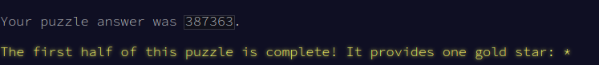
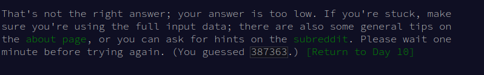

record time today!

---

If the there is ever a closing delimiter and no opening delimiter to compare
it to, my program will throw an error I think. Something like

```
<<>>)
```

will not have anything to compare the `)` to and will try to get `car '()`

There were not cases like that in the example or the input.  If there were I
guess an extra if would solve it, but I didn't want an untested if in the
program, because it could be wrong, so better to just have the error.

Also, I guess the input always has a an odd number of non corrupt lines for
the median to never be ambiguous?

---

Something funny happened with the website today.

It kept telling me I got the wrong answer in part i



And then when I went followed the link back to the question and tried to look
at the instructions closely and the input to find the curve ball that wasn't
in the example... I noticed this eventually as I got down the page



Besides that everything went pretty smooth today!
